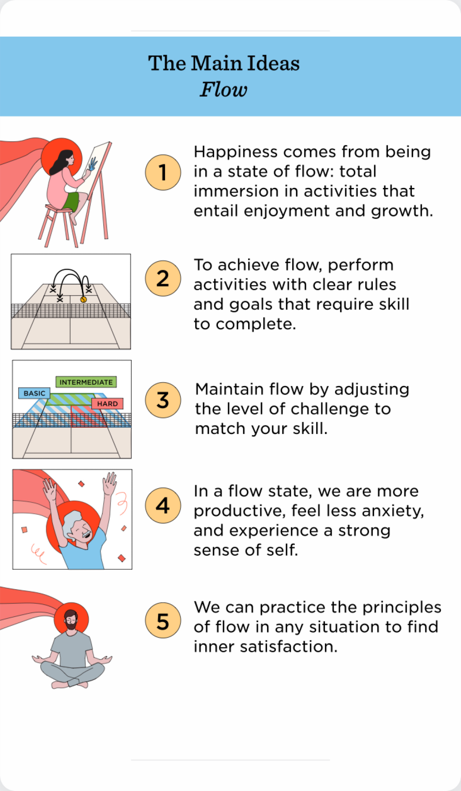

## Key Ideas
People often try to find happiness in singular stimuli such as going to a party or swiping through social media. However at the same time we define happiness as something continuous - or at least would love it to be this way. The idea of flow divides those things differentiating them as [Pleasure and Enjoyment](Pleasure%20and%20Enjoyment.md). 
